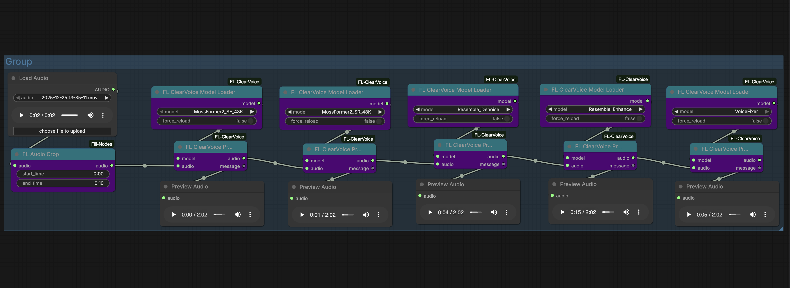

# FL ClearVoice

Audio enhancement nodes for ComfyUI featuring speech enhancement, super-resolution, denoising, and restoration using multiple AI backends.

[](https://github.com/modelscope/ClearerVoice-Studio)
[](https://www.patreon.com/Machinedelusions)



## Features

- **Speech Enhancement** - Remove noise and improve speech clarity
- **Super-Resolution** - Upscale low-quality audio to higher sample rates
- **Audio Restoration** - Fix degraded or compressed audio
- **Multiple Backends** - ClearVoice, Resemble-Enhance, and VoiceFixer models
- **Automatic Resampling** - Handles sample rate conversion automatically
- **Mono/Stereo Support** - Preserves original channel configuration

## Nodes

| Node | Description |
|------|-------------|
| **Model Loader** | Downloads and caches enhancement models |
| **Process** | Processes audio using the loaded model |

## Installation

### ComfyUI Manager
Search for "FL ClearVoice" and install.

### Manual
```bash
cd ComfyUI/custom_nodes
git clone https://github.com/filliptm/ComfyUI_FL-ClearVoice.git
cd ComfyUI_FL-ClearVoice
pip install -r requirements.txt
```

## Quick Start

1. Add **FL ClearVoice Model Loader** and select a model
2. Connect to **FL ClearVoice Process** node
3. Provide input audio
4. Run the workflow

## Models

### ClearVoice Models

| Model | Type | Output SR | Notes |
|-------|------|-----------|-------|
| MossFormer2_SE_48K | Enhancement | 48kHz | High quality speech enhancement |
| FRCRN_SE_16K | Enhancement | 16kHz | Fast speech enhancement |
| MossFormerGAN_SE_16K | Enhancement | 16kHz | GAN-based enhancement |
| MossFormer2_SR_48K | Super-Resolution | 48kHz | Audio upscaling |

### Resemble-Enhance Models

| Model | Type | Output SR | Notes |
|-------|------|-----------|-------|
| Resemble_Enhance | Full Enhancement | 44.1kHz | Denoise + enhance + vocoder |
| Resemble_Denoise | Denoise Only | 44.1kHz | Fast denoising |

### VoiceFixer

| Model | Type | Output SR | Notes |
|-------|------|-----------|-------|
| VoiceFixer | Restoration | 44.1kHz | All-in-one audio restoration |

Models download automatically on first use.

## Requirements

- Python 3.10+
- 8GB RAM minimum (16GB+ recommended)
- NVIDIA GPU recommended (CPU and Mac supported)

## Platform Notes

- **NVIDIA GPU**: Full acceleration for all models
- **Mac (MPS)**: ClearVoice uses MPS, Resemble-Enhance falls back to CPU due to conv1d channel limits
- **CPU**: All models supported, slower processing

## License

MIT
